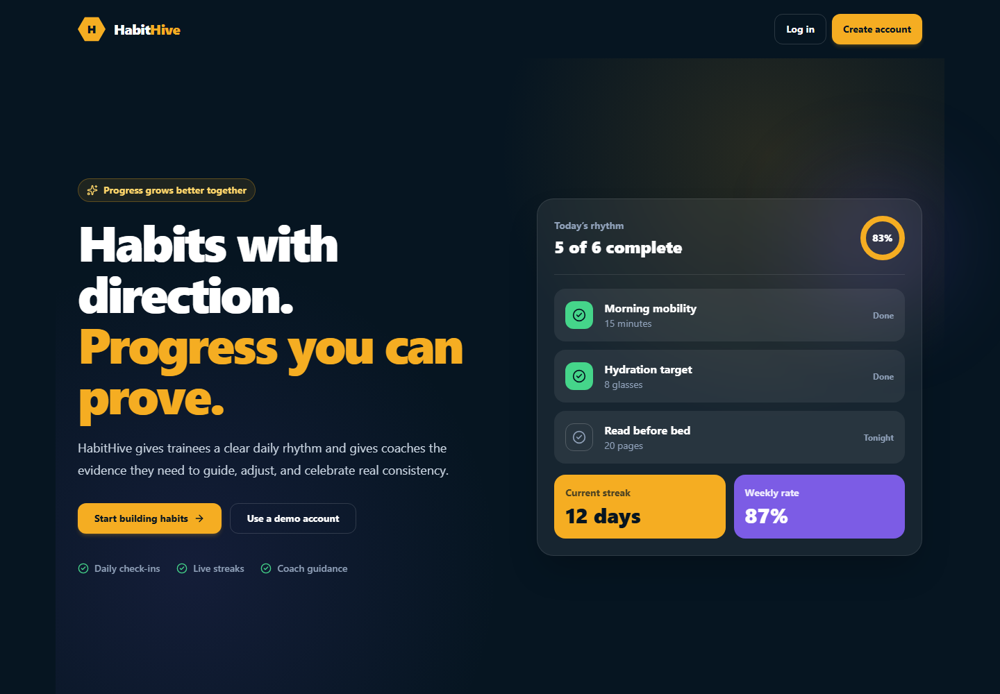
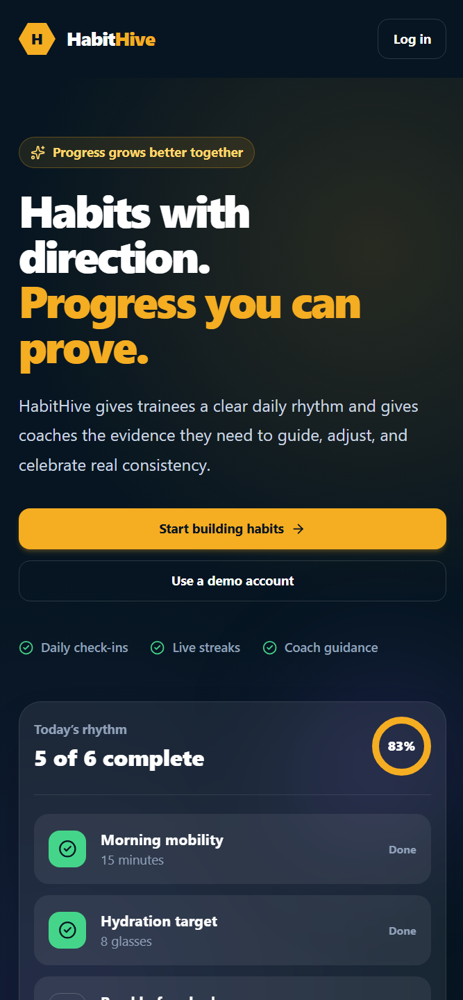
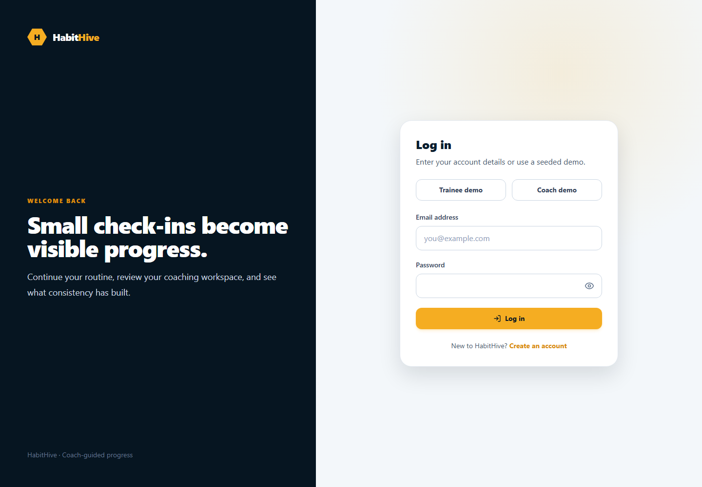

# HabitHive

HabitHive is a full-stack habit and progress tracking system for connected coaches and trainees. Trainees create personal habits, complete daily check-ins, and review measurable progress. Coaches connect with trainees, assign routines, set goals through the API, and monitor consistency without accessing unrelated accounts.

## Group members

- Wage, Andre Neal— Implemented The Database connections and backend.
- De Leon, Nico Emmanuel — contribution summary
- Manzano, Keith Patrick — contribution summary

## What the application processes

HabitHive derives useful information from habit schedules and daily check-ins instead of storing summary values:

- Daily and weekly completion rates
- Current and longest consecutive-day streaks
- Scheduled versus completed check-ins
- Coach-assigned versus personal habit performance
- Thirty-day category distribution
- Per-habit streak and completion totals
- Goal progress for completion rate, streak, and check-in targets
- Coach leaderboard ranked by weekly consistency
- Automatic goal expiry and relationship status transitions

## Technology stack

- React 19, Vite, and TypeScript
- Tailwind CSS 4 with a custom theme
- React Router
- React Hook Form and Zod
- Axios through one configured instance
- Node.js and Express
- MongoDB Atlas and Mongoose
- JWT and bcrypt for role-based accounts

## Project structure

```text
HabitHive/
├── client/
│   ├── src/components/   reusable interface components
│   ├── src/context/      authentication state
│   ├── src/hooks/        reusable API loading hook
│   ├── src/lib/          Axios, formatting, and theme utilities
│   ├── src/pages/        routed application screens
│   └── src/types/        shared frontend TypeScript types
└── server/
    ├── src/config/       database configuration
    ├── src/controllers/  request and response logic
    ├── src/middleware/   authentication, logging, 404, and errors
    ├── src/models/       Mongoose schemas
    ├── src/routes/       Express routers
    ├── src/services/     permissions and processing logic
    ├── src/scripts/      deterministic database seed
    ├── src/utils/        date, token, and error helpers
    └── test/             unit, API, and workflow tests
```


## Seeded demonstration accounts

| Role | Email | Password |
|---|---|---|
| Coach | `coach@habithive.test` | `HabitHive123!` |
| Trainee | `trainee@habithive.test` | `HabitHive123!` |
| Trainee | `jamie@habithive.test` | `HabitHive123!` |

## Application routes

HabitHive contains 15 routed screens: landing, login, registration, overview, today, habits, habit creation, habit editing, habit details, calendar, progress, goals, profile, trainee roster, trainee details, and coach assignment. Role guards prevent trainees and coaches from opening pages outside their workflow.

## REST API documentation

All protected routes use `Authorization: Bearer <token>`. Errors consistently return `{ "message": "..." }` with appropriate `400`, `401`, `403`, `404`, or `500` status codes.

### Authentication and users

| Method | Path | Purpose |
|---|---|---|
| POST | `/api/auth/register` | Create a coach or trainee account |
| POST | `/api/auth/login` | Validate credentials and return a JWT |
| GET | `/api/auth/me` | Return the authenticated account |
| POST | `/api/auth/logout` | End the client session |
| GET | `/api/users/trainees` | Search available trainee accounts (coach) |
| GET | `/api/users/coach-trainees` | List the coach's active trainees |
| GET | `/api/users/trainee-coach` | Return the trainee's active coach |
| PATCH | `/api/users/me` | Update the current profile |
| DELETE | `/api/users/me` | Deactivate the current account |
| GET | `/api/users/:id` | View an accessible user profile |

### Coach relationships

| Method | Path | Purpose |
|---|---|---|
| GET | `/api/relationships` | List the current user's relationships |
| GET | `/api/relationships/:id` | Get one accessible relationship |
| POST | `/api/relationships` | Invite a trainee by email |
| PATCH | `/api/relationships/:id/accept` | Accept a pending coach invitation |
| PATCH | `/api/relationships/:id/archive` | Archive an active relationship |
| DELETE | `/api/relationships/:id` | Permanently remove a relationship |

### Habits and check-ins

| Method | Path | Purpose |
|---|---|---|
| GET | `/api/habits` | List and filter accessible habits |
| GET | `/api/habits/:id` | Get one habit |
| POST | `/api/habits` | Create a personal habit |
| POST | `/api/habits/assign` | Assign a habit to an active trainee |
| PUT | `/api/habits/:id` | Update a habit |
| PATCH | `/api/habits/:id/status` | Activate or archive a habit |
| DELETE | `/api/habits/:id` | Delete a habit and its check-ins |
| GET | `/api/check-ins` | List and filter accessible check-ins |
| GET | `/api/check-ins/daily/:date` | Build a trainee's scheduled daily list |
| GET | `/api/check-ins/:id` | Get one check-in |
| POST | `/api/check-ins` | Create or replace a daily check-in |
| PUT | `/api/check-ins/:id` | Update a check-in |
| DELETE | `/api/check-ins/:id` | Remove a check-in |

### Goals and processing

| Method | Path | Purpose |
|---|---|---|
| GET | `/api/goals` | List goals with calculated progress |
| GET | `/api/goals/:id` | Get a goal with calculated progress |
| POST | `/api/goals` | Create a personal or coach goal |
| PUT | `/api/goals/:id` | Update a goal |
| PATCH | `/api/goals/:id/status` | Apply a valid goal status transition |
| DELETE | `/api/goals/:id` | Delete a goal |
| GET | `/api/analytics/overview` | Calculate daily/weekly rates and streaks |
| GET | `/api/analytics/weekly` | Calculate the seven-day completion series |
| GET | `/api/analytics/streaks` | Calculate per-habit current/longest streaks |
| GET | `/api/analytics/categories` | Aggregate 30-day category activity |
| GET | `/api/analytics/source-comparison` | Compare personal and assigned habits |
| GET | `/api/analytics/calendar` | Return monthly check-in history |
| GET | `/api/analytics/leaderboard` | Rank a coach's trainees by consistency |
| GET | `/api/health` | Verify that the API is running |

### Sample requests and responses

Register:

```json
POST /api/auth/register
{
  "name": "Alex Rivera",
  "email": "alex@example.com",
  "password": "StrongPass123!",
  "role": "trainee"
}
```

```json
201 Created
{
  "token": "<jwt>",
  "user": {
    "_id": "<user-id>",
    "name": "Alex Rivera",
    "email": "alex@example.com",
    "role": "trainee"
  }
}
```

Create a check-in:

```json
POST /api/check-ins
{
  "habitId": "<habit-id>",
  "date": "2026-10-08",
  "status": "completed",
  "value": 20,
  "note": "Completed before breakfast."
}
```

Overview response:

```json
200 OK
{
  "overview": {
    "activeHabits": 4,
    "today": { "scheduled": 4, "completed": 3, "rate": 75 },
    "week": { "scheduled": 26, "completed": 22, "rate": 85 },
    "currentStreak": 7,
    "longestStreak": 12
  }
}
```

Validation error:

```json
400 Bad Request
{
  "message": "Validation failed",
  "details": [{ "field": "title", "message": "Habit title is required" }]
}
```

## Verification

```bash
npm run lint
npm run build
npm test
```

The test suite covers analytics calculations, health and JSON 404 behavior, plus the complete account → invitation → assignment → check-in → analytics workflow against an isolated MongoDB instance.

## Screenshots

### Landing page — desktop



### Landing page — 375px responsive layout



### Authentication



Add dashboard screenshots after connecting and seeding Atlas so the final documentation uses live application data.

## Known limitations

- Authentication uses access tokens in local storage; production deployments should prefer secure HTTP-only refresh cookies.
- Email verification, password recovery, notifications, file uploads, and payments are outside the required project scope.
- The application uses one active coach per trainee, while a coach may have many trainees.
- Deployment configuration is intentionally omitted because deployment is optional in the course rubric.
